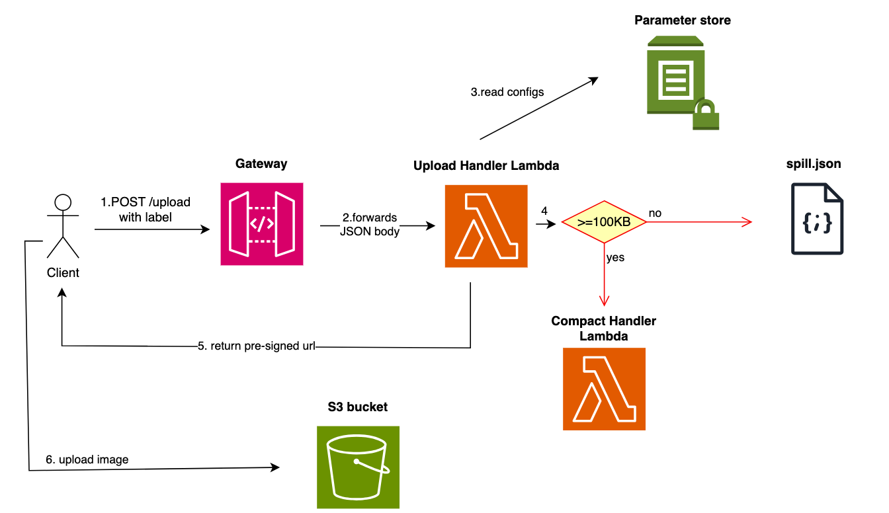
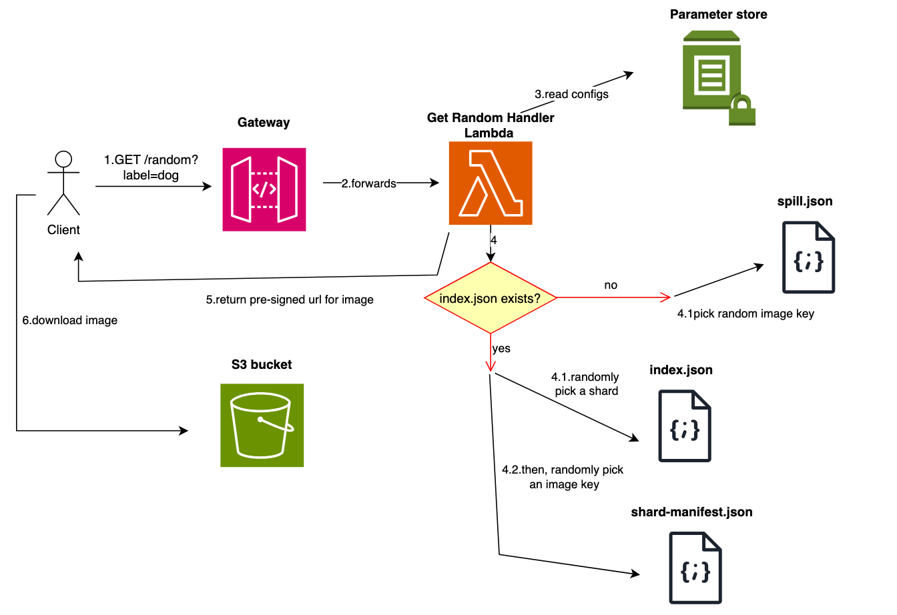
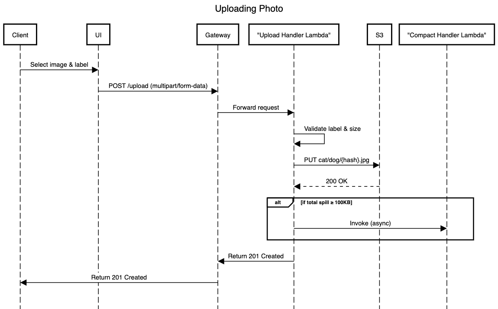
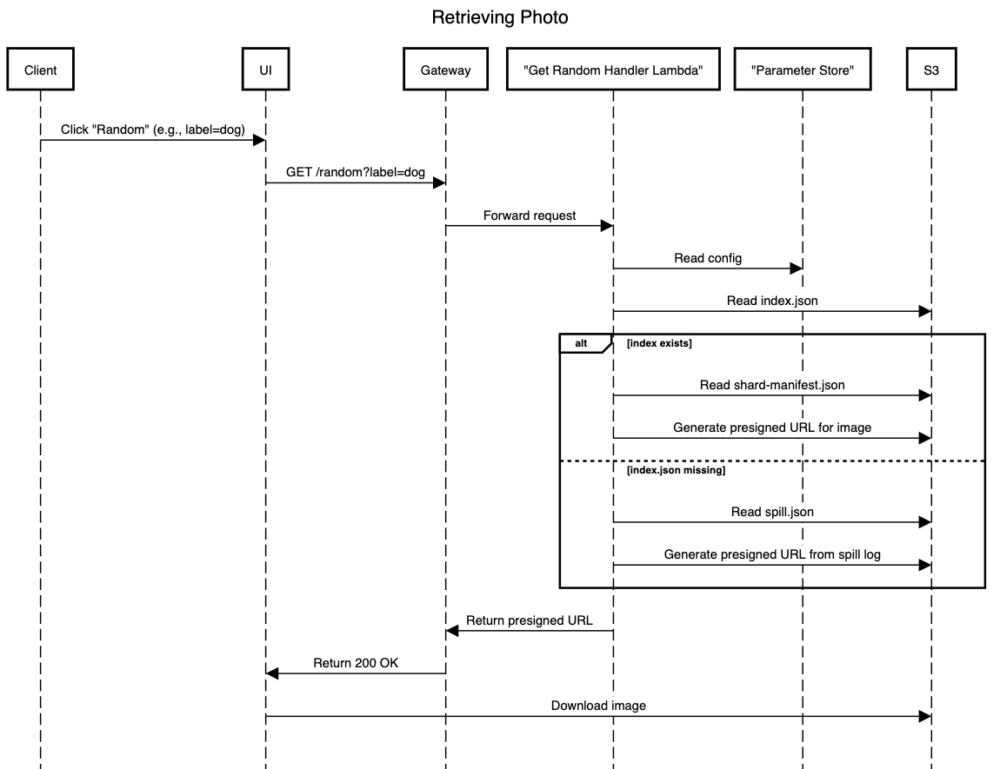

# Pet Images API

## Table of Contents

1. [Features](#features)
2. [Architecture](#architecture)
3. [API End‑Points](#api-end‑points)
4. [Performance Benchmarks](#performance-benchmarks)
5. [Cost Estimates](#cost-estimates)
6. [Local Development](#local-development)
7. [Deployment Guide](#deployment-guide)
8. [License](#license)

---

## Features

| Category        | Details                                                                                                       |
| --------------- | ------------------------------------------------------------------------------------------------------------- |
| **Frontend**    | Next.js 15 (App Router), TypeScript, TailwindCSS, Dark/Light mode switch, Drag‑and‑drop uploader          |
| **Backend**     | AWS API Gateway, AWS Lambda (Python 3.12, boto3), 100 % Serverless, S3 storage (hierarchical sharding) |
| **Security**    | Presigned URLs are not exposed, Lambda sanitises content‑type & label, CORS locked to production origin     |
| **CI/CD**       | Vercel (frontend) |

---

## Architecture

> **100 % Serverless** — every line of backend code resides in stateless AWS Lambda functions. No EC2, ECS, or long‑running servers to patch or scale.

### Flow Diagrams

Below are two high-level diagrams illustrating system flow.

#### Upload Flow



#### Retrieval Flow



### Sequence Diagrams


#### Upload Flow



#### Retrieval Flow



---

## API End‑Points

| Method   | Path                       | Description                  | Request                                                           | Success Response                                  |
| -------- | -------------------------- | ---------------------------- | ----------------------------------------------------------------- | ------------------------------------------------- |
| **POST** | `/upload?label={cat\|dog}` | Upload a cat/dog image       | `multipart/form-data` with:<br>• `file` – image (.jpg/.png/.webp) | `201 Created` JSON:<br>`{ "key": "cat/abc.jpg" }` |
| **GET**  | `/random?label={cat\|dog}` | Fetch random image for label | Query param `label`                                               | `200 OK` JSON:<br>`{ "url": "https://..." }`      |

Error codes: `400` invalid label · `404` no images · `415` unsupported media type · `500` on uncaught errors.

---

## Performance Benchmarks

Below is a *theoretical* cost breakdown showing how each step scales with input size rather than absolute wall‑clock latency (which depends on network conditions).

### Notation

* **n** – number of shard index files per label (e.g., `0.json.gz`, `1.json.gz`, …), capped at 5000 entries each in a flat 1-level sharding structure
* **s** – image payload size in bytes

### Upload Path

| Step                                           | Complexity                  | Notes                                                |
| ---------------------------------------------- | --------------------------- | ---------------------------------------------------- |
| Read multipart stream                          | **O(s)**                    | Streamed directly from API Gateway to Lambda memory. |
| SHA‑256 hash (key)                             | **O(s)**                    | Guarantees content‑addressed key uniqueness.         |
| Label & MIME validation                        | **O(1)**                    | Regex and constant‑time lookups.                     |
| S3 PUT object                                  | **O(s)**                    | Network + S3 write   |
| Append to *spill.log* (if no index)            | **O(1)**           | 
| Asynchronous *compact‑handler* (index rebuild) | **O(1)** per \~1 000 images |   |

### Retrieval Path

| Step                     | Complexity   | Notes                                           |
| ------------------------ | ------------ | ----------------------------------------------- |
| Generate random rank `r` | **O(1)**     | `randint(1,total)` in Lambda.                   |
| Binary search shard list | **O(log n)** | Cumulative counts allow 8 or fewer comparisons. |
| Fetch shard metadata     | **O(1)**     | ≤ 4 KB JSON.                                    |
| Select key within shard  | **O(1)**     | Array index into in‑memory list.                |
| S3 GET object            | **O(s)**     | Network + S3 read.            |

---

## Cost Estimates

Scenario **10 k uploads/day + 50 k retrievals/day** (≈ 1.8 M req/mo, 200 GB storage):

| Service      | Monthly Usage       | Unit Price (\$)    | Total (\$)   |
| ------------ | ------------------- | ------------------ | ------------ |
| S3 (storage) | 200 GB              | \$0.023            | **\$4.60**   |
| S3 (PUT)     | 60,000 requests     | \$0.005 / 1K       | **\$0.30**   |
| S3 (GET)     | 1,500,000 requests  | \$0.0004 / 1K      | **\$0.60**   |
| Lambda       | 256MB × 0.1s × 1.8M | \$0.0000167 / GB‑s | **\$0.75**   |
| API Gateway  | 1.8M requests       | \$1.00 / 1M        | **\$1.80**   |
| **Total**    |                     |                    | **≈ \$8.05** |

\* Prices: `us-east-1`, June 2025. See the [Google Sheets calculator](https://docs.google.com/spreadsheets/d/126Fys0u7iEPpZ2jjmUQx2OlGEdPvOdL92St0DY9q0hI/edit?usp=sharing) for full cost model and assumptions.

---


## Local Development

````bash
# 1. Frontend
cd random-pet-photo
cp .env.example .env.local   # Set NEXT_PUBLIC_API_BASE
npm run dev

# 2. Backend (SAM)
cd infra
sam build && sam local start-api
````

### Environment Variables

| Name                                            | Where  | Description                                                                                   |
| ----------------------------------------------- | ------ | --------------------------------------------------------------------------------------------- |
| `BUCKET_NAME` (default: `pet-images-m250-prod`) | Lambda | Target S3 bucket                                                                              |
| `ALLOWED_ORIGIN`                                | Lambda | CORS origin (e.g. [https://random-pet-photo.vercel.app](https://random-pet-photo.vercel.app)) |

---

## Deployment Guide

### Infrastructure-as-Code

The entire backend stack is defined in [`template.yaml`](./infra/template.yaml) using **AWS SAM** (a simplified form of CloudFormation). It sets up:

* S3 bucket `pet-images-m250-prod`
* Three Lambda functions (upload, retrieve, compact)
* An HTTP API Gateway with `/upload` and `/random` routes
* All necessary IAM policies and CORS settings

#### Prerequisites

**Install AWS CLI** (required for AWS authentication):

```bash
# macOS (Homebrew) - Recommended
brew install awscli

# macOS (Direct installer)
curl "https://awscli.amazonaws.com/AWSCLIV2.pkg" -o "AWSCLIV2.pkg"
sudo installer -pkg AWSCLIV2.pkg -target /

# Verify installation
aws --version
```

Configure AWS CLI with your credentials:
```bash
aws configure
```

You'll be prompted to enter:
- **AWS Access Key ID**: Your AWS access key
- **AWS Secret Access Key**: Your AWS secret key  
- **Default region name**: e.g., `us-east-1`, `us-west-2`
- **Default output format**: `json` (recommended)

> **💡 Tip**: You can get AWS credentials from the [AWS Console](https://console.aws.amazon.com/) → IAM → Users → Security credentials → Create access key

**Install AWS SAM CLI** (required for deployment):

```bash
# macOS (Homebrew)
brew install aws-sam-cli

# Windows (Chocolatey)
choco install aws-sam-cli

# Linux / Manual Installation
# Download from: https://github.com/aws/aws-sam-cli/releases/latest
# Or use pip: pip install aws-sam-cli
```

Verify installation:
```bash
sam --version
```

#### Deploy Backend

To deploy:

```bash
cd infra
sam build
sam deploy --guided
```

* Accept defaults or configure stack name/region
* After deployment, SAM will print an `ApiUrl` — paste it into your Vercel env var `NEXT_PUBLIC_API_BASE`

To update the backend:

```bash
sam build && sam deploy
```

### Frontend deployment

Vercel auto-builds on every push to `main`. Set the correct backend endpoint via project settings:

```
NEXT_PUBLIC_API_BASE=https://<your-api>.execute-api.<region>.amazonaws.com
```

## Design Decisions & Technical Challenges

### Key Design Decisions

* **Compact Handler (Decoupled Indexing)**: Instead of building/updating index files during the main image upload, the system asynchronously invokes a compact-handler. This keeps upload latency low and isolates heavy I/O in a background task.
* **Uniform Weights (for Random Selection)**: While the bonus spec allows per-image weighting, we defaulted to uniform weights to simplify shard structure, avoid floating-point precision issues in cumulative weights, and ensure fairness. The codebase is modular enough to later support weighted selection.
* **UUID-Based Keys**: Images are stored using UUID v4 identifiers combined with labels (e.g., `cat/uuid.jpg`) to ensure uniqueness and avoid name collisions.
* **Distributed Database Simulation**: The system simulates a distributed database by splitting image metadata into multiple shards (`0.json.gz`, `1.json.gz`, etc.) with `index.json` serving as the metadata manager that tracks shard boundaries and cumulative counts for efficient random selection.

### Edge Cases Handled

* **Missing index files**: If `index.json` is missing (e.g. first-time upload), the random handler falls back to `spill.json` for retrieval.
* **Empty label folder**: When no images exist for a label (cat/dog), the system returns a `404` with a helpful message.
* **Invalid content types**: Rejects uploads with non-image MIME types (`application/*`, etc.) via explicit `Content-Type` validation.
* **Invalid labels**: Upload and retrieval endpoints validate the label is one of `cat` or `dog`.

### Technical Challenges

* **Binary multipart parsing**: Manual parsing of multipart form-data was required inside Lambda without 3rd-party libraries due to challenge constraints.
* **Sharded manifest structure**: Instead of a deep shard tree, we maintain capped shard files (e.g., `0.json.gz`) holding up to 5,000 keys each. This keeps complexity low and enables O(log n) retrieval within a flat namespace.
* **Write contention**: To avoid race conditions in `spill.json`, the system appends using small atomic writes, and defers bulk rebuilds to the `compact-handler`.


---

## License

[MIT](LICENSE)

---

### Author

William Nguyen · [@william‑nguyen](https://github.com/ngnamquoc)

---
